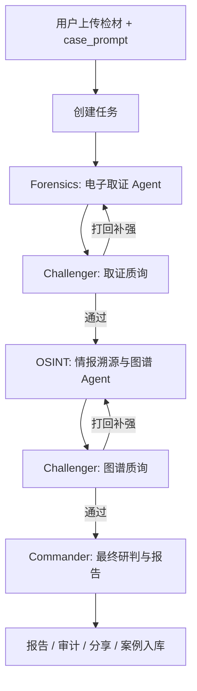

# TruthSeeker

TruthSeeker 是一个跨模态恶意 AIGC 鉴伪、情报溯源与人机协同研判系统。它不是单点检测器，而是把多模态大模型、专业鉴伪工具、OSINT、证据图谱、逻辑质询和人工回注串成一条可审计的研判链路。

当前代码库采用 **Fed-MBPR-compatible** 运行时架构：底层检测器保持可替换，项目文档中的 Fed-MBPR 训练底座见另一个 Fed-MBPR 仓库。

## 核心能力

- **跨模态输入**：一次任务最多上传 5 个文件，支持文本、图片、音频、视频及组合模态；文本框作为案件背景 `case_prompt`，不作为直接检测文本。
- **阶段式四 Agent 研判**：电子取证 Agent、情报溯源 Agent、逻辑质询 Agent、研判指挥 Agent 通过 LangGraph 编排。
- **专业工具 all-settled 调用**：Reality Defender、VirusTotal、Exa、WhoisXML、内部文本 AIGC 检测器均以结构化成功/降级/失败结果进入证据板。
- **逻辑质询与收敛门槛**：Challenger 对取证和溯源阶段执行硬门槛审查；前 4 轮低于 0.8 必须打回，第 5 轮放行并写入残留风险。
- **人机协同**：低置信停滞时自动暂停，用户可邀请专家，Commander 汇总协同摘要，用户确认后恢复研判。
- **可审计报告**：输出 Markdown/PDF 报告、审计日志、稳定 `report_hash` 和 provenance graph。
- **公开案例库与 RAG**：用户授权公开且完成报告的任务可脱敏入库，并索引为类案参考。
- **个人经验库**：协同结束后可生成账号私有经验草稿，用户单独确认入库，后续 Forensics/OSINT/Challenger 可按账号检索复用。

## 运行时架构



Commander 生成最终裁决后直接结束工作流，不再进入 Challenger。

## 技术栈

### 前端

- Next.js 16.1.6 + App Router
- React 19.2.3
- TypeScript 5
- Tailwind CSS 4
- `motion` 12
- React Three Fiber 9 + Drei 10
- Supabase SSR
- React Flow (`@xyflow/react`)
- Vitest + Testing Library

### 后端

- FastAPI 0.134.0
- Python 3.11+
- LangGraph 1.x
- Pydantic 2 / pydantic-settings
- Supabase Python client
- fpdf2 / Pillow
- pgvector on Supabase

## 目录结构

```text
.
├── truthseeker-web/          # Next.js 前端
│   ├── app/                  # App Router 页面、布局、route handler
│   ├── components/           # 检测台、协同、案例库、经验库、仪表盘、UI 组件
│   ├── hooks/                # SSE、Realtime、交互与动画 hooks
│   ├── lib/                  # API 映射、报告、Supabase、共享工具
│   └── public/               # 图标、字体、图片资源
├── truthseeker-api/          # FastAPI 后端
│   ├── app/api/v1/           # upload/tasks/detect/report/share/cases/experiences/collaboration
│   ├── app/agents/           # LangGraph state、nodes、edges、tools
│   ├── app/services/         # 持久化、报告、RAG、协同、审计、输入校验
│   ├── app/middleware/       # 认证、限流、异常处理
│   ├── sql/migrations/       # Supabase schema 迁移
│   └── tests/                # pytest
├── docs/                     # 产品、架构、流程、前后端与实施文档
├── task.md                   # 里程碑与当前任务状态
├── lessons.md                # 已知坑与修复经验
├── AGENTS.md                 # 跨工具 AI 代理指引
└── CLAUDE.md                 # Claude Code 兼容入口，导入 AGENTS.md
```

## 快速开始

### 1. 准备环境

- Node.js 20+
- npm
- Python 3.11+
- Supabase 项目
- 可选外部服务 key：Kimi/Moonshot 或 MiMo、Reality Defender、VirusTotal、Exa、WhoisXML、SiliconFlow Embedding

### 2. 配置前端

```powershell
cd truthseeker-web
copy .env.example .env.local
npm install
npm run dev
```

前端默认运行在 `http://localhost:3000`。关键变量：

```env
NEXT_PUBLIC_SUPABASE_URL=
NEXT_PUBLIC_SUPABASE_PUBLISHABLE_KEY=
NEXT_PUBLIC_API_BASE_URL=http://localhost:8000
NEXT_PUBLIC_SITE_URL=http://localhost:3000
```

### 3. 配置后端

首次接入新的 Supabase 项目时，现有迁移尚不能自动创建上传接口依赖的 `media` Storage bucket 与对应 Storage RLS。启动服务前需人工配置，或先补齐幂等迁移；否则健康检查可能正常，但文件上传会失败。详见 `docs/KNOWN_GAPS.md`。

```powershell
cd truthseeker-api
copy .env.example .env
python -m pip install -r requirements.txt
python -m uvicorn app.main:app --reload
```

后端默认运行在 `http://localhost:8000`，健康检查：

```powershell
Invoke-RestMethod http://localhost:8000/health
```

关键变量类别：

- Supabase：`SUPABASE_URL`、`SUPABASE_SERVICE_ROLE_KEY`、`SUPABASE_ANON_KEY`、`SUPABASE_JWT_SECRET`
- Agent LLM：`AGENT_LLM_PROVIDER`、`KIMI_*`、`MIMO_*`
- 媒体/情报工具：`REALITY_DEFENDER_API_KEY`、`VIRUSTOTAL_API_KEY`、`EXA_API_KEY`、`WHOISXML_API_KEY`
- RAG/Embedding：`CASE_RAG_ENABLED`、`EMBEDDING_*`
- App：`APP_ENV`、`FRONTEND_URL`、`MAX_ROUNDS=5`、`CONVERGENCE_THRESHOLD=0.08`

生产环境必须配置真实 `SUPABASE_JWT_SECRET`，不能使用 `NOT_SET`。

## 常用命令

### 前端

```powershell
cd truthseeker-web
npm run lint
npm run typecheck
npm run test:unit
npm run build
```

### 后端

```powershell
cd truthseeker-api
python -m pytest tests
python -m uvicorn app.main:app --reload
```

在当前 Windows 工作区，若存在 `truthseeker-api\venv_new\Scripts\python.exe`，后端测试优先使用该解释器。

## 主要页面

- `/`：产品首页
- `/login`、`/signup`、`/forgot-password`、`/reset-password`：认证流程
- `/detect`：上传与任务创建
- `/detect/[taskId]`：实时检测工作台
- `/report/[taskId]`：公开报告页
- `/cases`、`/cases/[caseId]`：公开案例库
- `/experiences`、`/experiences/[entryId]`：个人经验库
- `/dashboard`：数据大屏

## API 入口

所有业务 API 默认挂载在 `/api/v1`：

- `POST /upload/`
- `POST /tasks`、`GET /tasks`、`GET /tasks/{task_id}`
- `POST /detect/stream`
- `GET /report/{task_id}/md`
- `GET /report/{task_id}/pdf`
- `GET /report/{task_id}/audit-log.md`
- `GET /report/{task_id}/audit-log.pdf`
- `POST /share/{task_id}`、`GET /share/{token}`
- `GET /dashboard/overview`
- `GET /cases`、`GET /cases/{case_id}`、`POST /cases/{case_id}/preview-url`、`GET /cases/{case_id}/files/{file_id}/text`、`DELETE /cases/{case_id}`
- `GET /experiences`、`GET /experiences/{entry_id}`、`POST /experiences/confirm`、`DELETE /experiences/{entry_id}`
- `POST/GET /collaboration/...`

`/api/v1/consultation` 仍作为旧兼容别名保留，新功能应优先使用 `/api/v1/collaboration`。当前 canonical 专家公开路径的生产认证白名单仍待修复，见 `docs/KNOWN_GAPS.md`。

## 数据库与迁移

迁移文件位于 `truthseeker-api/sql/migrations/`。当前主要表包括：

- 基础任务与结果：`profiles`、`tasks`、`analysis_states`、`agent_logs`、`reports`、`audit_logs`
- 旧兼容协同：`consultation_sessions`、`consultation_invites`、`consultation_messages`
- 新人机协同：`collaboration_sessions`、`collaboration_invites`、`collaboration_messages`
- 公开案例：`case_library_entries`、`case_library_rag_chunks`
- 个人经验：`experience_library_entries`、`experience_library_rag_chunks`

pgvector 用于公开案例 RAG 与个人经验库 RAG。若真实 Supabase 尚未应用迁移，本地代码测试只能验证逻辑，不能证明线上数据库已就绪。

## 文档索引

- `docs/TECH_STACK.md`：依赖版本、环境变量、外部能力边界
- `docs/APP_FLOW.md`：任务创建、SSE、人机协同、报告、案例库和经验库主流程
- `docs/BACKEND_STRUCTURE.md`：后端目录、状态字段、Graph、工具、持久化、测试要求
- `docs/FRONTEND_GUIDELINES.md`：视觉语言、组件标准、动效与 3D 设计
- `docs/PRD.md`：产品目标、功能模块、展示场景和风险
- `docs/IMPLEMENTATION_PLAN.md`：历史实施计划与路线回顾
- `task.md`：里程碑状态
- `lessons.md`：开发错误记录本
- `AGENTS.md`：AI 代理工作规则

## 当前限制

- Fed-MBPR 训练底座不是当前运行时代码的一部分，在另一个仓库。
- 多数外部检测、情报和 embedding 能力依赖第三方 key、额度和网络；失败时系统应结构化降级。
- 真实端到端验证需要 Supabase、Storage、外部 API key 和前后端同时运行。

## 安全说明

- 不要提交 `.env`、`.env.local`、真实 API key、Supabase service role key 或 JWT secret。
- 报告、日志、SSE 事件和公开案例不得保存永久 signed URL、原始 token 或完整第三方原始响应。
- 公开案例只保存脱敏字段和展示所需元数据；个人经验库按账号隔离，不公开共享。
