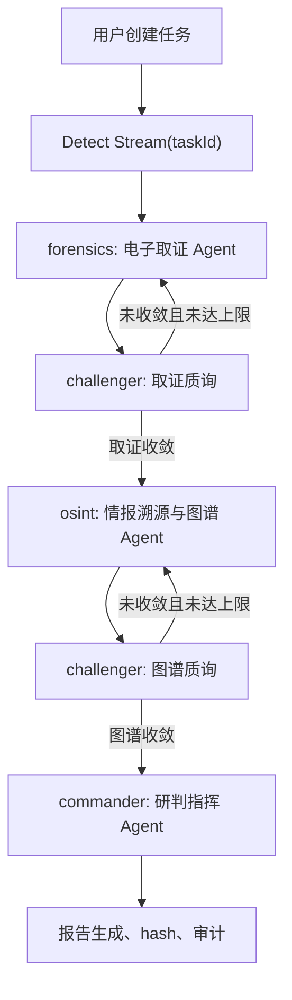
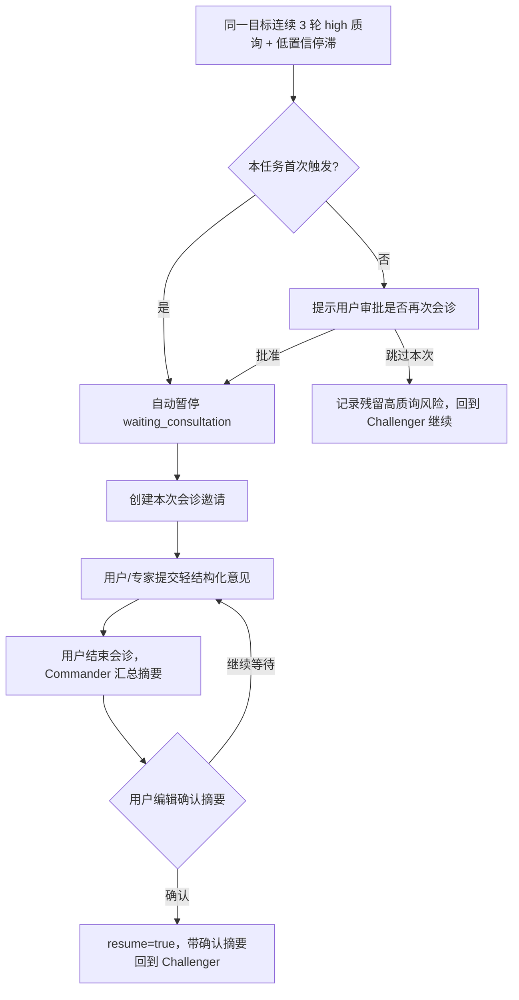

# TruthSeeker 应用流程

> 更新时间：2026-06-02

## 1. 输入边界

用户一次最多上传 5 个检材文件。后端按模态执行分类型大小限制：

- 视频：250MB，上限对齐 Reality Defender 当前视频处理能力。
- 音频：20MB。
- 图片：50MB。
- 文本文件：5MB，仅支持安全文本扩展名和可打印文本内容。

上传页文本框不是待检测文本输入区，而是 `case_prompt`：用于记录案件背景、检测目标、来源线索和重点风险。真正需要检测的文本必须以文本检材文件上传。

每个 Agent 都会接收全局输入视图，包括用户提示词、文件清单、短期 signed URL、模态、文件摘要和上一阶段证据。区别只在专业分工：电子取证侧重取证鉴伪，OSINT 侧重联网溯源，Challenger 侧重逻辑审查，Commander 侧重最终研判。

## 2. 任务创建

前端流程：

1. 用户选择 1 到 5 个文件。
2. 前端逐个调用 `POST /api/v1/upload/` 上传文件。
3. 后端返回标准文件对象：`id`、`name`、`mime_type`、`size_bytes`、`modality`、`storage_path`、可选 `file_url`。
4. 前端调用 `POST /api/v1/tasks` 创建任务。
5. 检测页只携带 `taskId`，不依赖 URL 中传 signed file URL。

如果用户勾选“愿意脱敏后公开至案例库”，上传端额外要求单个公开视频检材不超过 50MB，并把文件 SHA-256 写入任务文件清单。任务创建时会用“文件 SHA-256 集合 + 规范化 `case_prompt`”检查公开案例库是否已有重复案例；重复时检测照常进行，但不会重复入库。

任务表约定：

- `description` 保存 `case_prompt`。
- `metadata.files` 保存标准化文件清单。
- `storage_paths.files` 保存文件名、模态和 storage path。
- `input_type` 由后端根据文件模态推导，使用 15 个规范组合值：`text`、`image`、`audio`、`video` 四个单模态，双模态、三模态和四模态按 `text_image`、`text_image_video`、`text_image_audio_video` 这类下划线 key 记录；历史 `mixed` 在迁移中统一改为 `text_image`，展示为“图文混合”。
- 服务端只信任 JWT 中的 `request.state.user_id`。

## 3. 检测状态机

新运行时拓扑采用“阶段式四 Agent 研判”，对外仍保留 `forensics/osint/challenger/commander` 四个协议 key：

阶段规则：

- 自主推理先行：四个 Agent 都先基于 Kimi 2.5 原生多模态能力读取可访问样本、文本内容、全局检测目标和证据板，并禁用 thinking，再按角色调用外部工具，最后融合自主推理与工具结果完成任务。
- `forensics` 不再是“只看视听”的专家，而是电子取证 Agent。它基于 Kimi 2.5 多模态上下文读取所有样本，图片默认调用 Sightengine `genai` 做 AIGC 图片检测，音视频保留 Reality Defender 合成/篡改检测，文本检材调用内部 `ai_text_detector` 做多信号文本 AIGC 概率分析，文件哈希和 IOC 调用 VirusTotal。系统主字段统一使用 `aigc_probability`、`is_aigc` 和 `aigc_score`，旧 `deepfake_*` 只用于读取历史快照的兼容 fallback。
- `osint` 回归情报溯源，读取取证证据、全局输入和脱敏搜索线索，调用 Exa API、VirusTotal、WhoisXML，并复用内部文本 AIGC 检测与 `text_claim_extract` 结果补充社工诱导和文本来源研判，生成可视化情报溯源图谱。
- `challenger` 只审查取证报告和溯源图谱。它会读全局证据板和原始样本上下文，先做自身逻辑质询，再结合硬门槛决定是否打回对应阶段。
- `commander` 生成最终鉴伪与溯源报告。它综合样本、证据板、Challenger 反馈和各 Agent 结论进行自主裁决；裁决完成后直接结束检测，不再进入 Challenger，避免最终报告阶段重复前序质询。
- 每阶段最多 5 轮，质量变化阈值为 0.08。达到阈值则视为收敛；达到轮次上限仍未完全解决时继续推进，但写入残留风险。
- 人机会诊触发采用统一门槛：同一目标 Agent 最近 3 轮都存在 high 质询，本轮置信度 `< 0.8`，且最近三轮相邻置信度变化均 `< 0.08`。首次触发自动暂停为 `waiting_consultation`；同一任务后续再次触发进入 `waiting_consultation_approval`，由用户决定“再次会诊”或“跳过本次”。

## 4. 人机专家会诊

会诊不是普通聊天，也不是事后批注。它是自动流程遇到高争议证据时的人工证据回注机制。

会诊状态流：

会诊合同：

- 邀请按 `task_id` 和 `consultation_session.id` 绑定，默认 24 小时 TTL；样本链接沿用本轮邀请有效期，不生成永久公开链接。
- 消息保存为轻结构化记录：`session_id`、`message_type`、`anchor_agent`、`anchor_phase`、`confidence`、`suggested_action` 和 `metadata`。
- Commander 是主持人，负责在会诊开始时给出背景、进展、卡点和求助点；用户显示为“用户”，邀请链接访问者显示为“专家”。
- 只有用户能批准重复会诊、跳过本次、结束会诊、编辑确认 Commander 摘要。摘要确认后回注全局证据板，流程恢复到 Challenger。
- 会诊恢复时，后端通过 `resume=true` 注入专家/用户消息、会诊 sessions 和已确认摘要；若 LangGraph checkpoint 丢失，则从 `analysis_states`、`consultation_messages` 和 `consultation_sessions` 重建可裁决状态。

## 5. 工具调用与降级

专业工具必须使用 `all-settled` 语义：所有工具都要返回结构化结果，结果可以是 `success`、`degraded` 或 `failed`。任务不能因为某个工具失败就伪装成正常检测，也不能无限等待。

工具策略：

- 首轮全量调用：图片进 Sightengine `genai`，音视频进 Reality Defender，文本检材进内部 `ai_text_detector` / `text_claim_extract`；所有媒体哈希、文本 IOC 和 OSINT 新发现 IOC 进 VirusTotal，URL/域名线索进 WhoisXML 查询 WHOIS 与 DNS 历史。工具层可以保留 provider 原始标签（如 `AI_GENERATED`），但报告、SSE 和持久化裁决不得把图片 AIGC 概率混写成 Deepfake 概率。
- 后续智能重跑：只重跑失败、降级、被 Challenger 命中或新 IOC 对应的工具。
- Exa 搜索只发送脱敏线索：URL、域名、哈希、公开实体名、短关键声明，不发送完整原文或完整媒体描述。
- VirusTotal URL 检测必须等待 URL analysis `completed` 后才采信新扫描统计；如果提交后的 analysis 仍是 `queued`，会回查 VT 已有 URL 报告的 `last_analysis_stats` 作为补救。同一任务内相同 URL 复用同一个 completed 或历史报告结果，避免 Forensics/OSINT 对同一 URL 得到互相矛盾的“8 家 vs 0 家”统计。
- 公开案例 RAG 由 Forensics 和 OSINT 作为内部工具调用。语料来自用户授权公开的真实案例和 4 个内置案例 Markdown，使用 pgvector + 全文检索混合召回；命中结果只作为类案参考和复核方向，不直接改变当前裁决分数。
- 内部文本 AIGC 检测由 Forensics 和 OSINT 作为内部工具调用，融合 Kimi 文本判断、本地句长/词汇/重复/模板化统计和社工诱导特征；输出是概率性线索，不作为单独定性证据。
- 所有外部工具保留硬超时；超时必须写成结构化失败结果。

## 6. 情报溯源图谱

图谱采用混合模型：

- 实体关系图：URL、域名、IP、文件哈希、人物、组织、账号、地点等。
- W3C PROV 风格溯源链：样本、工具查询、提取活动、证据、结论之间的来源关系。
- Claim/Evidence/Challenge 图：声明、支持证据、反证、质询点和最终裁决。

图谱写入：

- 阶段结果：`osint_result.provenance_graph`
- 最终审定版：`final_verdict.provenance_graph`

图谱字段：

- `nodes`: `artifact/entity/source/evidence/finding/claim/event/agent/verdict`
- `edges`: `extracted_from/mentions/derived_from/supports/refutes/contradicts/reviewed_by/before/after`
- `citations`: 来源 URL、检索时间、摘要、文件哈希、API 结果摘要
- `quality`: 完整性、引用覆盖率、模型推断比例、Challenger 审查结果

无引用但来自模型推理的关系可以进入图谱，但必须标记 `model_inferred=true`，不能作为外部事实展示。

## 7. SSE 事件

检测流使用 `POST /api/v1/detect/stream` 返回 SSE。保留现有事件契约：

- `start`
- `node_start`
- `agent_log`
- `evidence_update`
- `challenges_update`
- `forensics_result`
- `osint_result`
- `challenger_feedback`
- `timeline_update`
- `weights_update`
- `round_update`
- `final_verdict`
- `node_complete`
- `consultation_required`
- `consultation_approval_required`
- `consultation_started`
- `consultation_summary_pending`
- `consultation_summary_confirmed`
- `consultation_skipped`
- `consultation_resumed`
- `task_failed`
- `error`
- `case_import_start`
- `case_import_created`
- `case_import_duplicate`
- `case_import_skipped`
- `case_import_error`
- `complete`

`final_verdict` 后，如果任务已勾选公开案例库，后端会先推送 `case_import_start`，生成公开案例标题和摘要并尝试入库/索引，然后推送 `case_import_created`、`case_import_duplicate` 或 `case_import_error`；未勾选时推送 `case_import_skipped`。`complete` 在案例导入阶段终态之后发送，前端报告按钮只在 `complete` 且导入阶段结束后显示。历史回放中的已完成任务默认视为导入阶段已结束，不重新触发入库。

新图谱不新增必须消费的新 SSE 事件，随 `final_verdict.provenance_graph` 下发；历史回放从 `reports.verdict_payload`、`analysis_states.result_snapshot`、`agent_logs`、`timeline_events` 和 `audit_logs` 读取。

## 8. 报告与可信输出

检测完成后，Commander 生成最终裁决，后端写入 `reports`：

- `verdict`: 仍沿用 `authentic/suspicious/forged/inconclusive`
- `confidence_overall`
- `summary`
- `key_evidence`
- `recommendations`
- `verdict_payload`
- `report_hash`

`verdict_payload` 承载子结论：取证结论、溯源结论、威胁判断、图谱质量、Challenger 审查结果和 `provenance_graph`。主 verdict 不扩展枚举，避免破坏数据库和前端颜色体系。

如果发生会诊，`verdict_payload` 还应包含会诊状态、邀请与确认摘要、专家意见数量、主持人最终动作和残留争议。Markdown/PDF 报告需要展示会诊触发原因、专家共识/分歧、Commander 摘要、主持人确认时间，以及这些意见如何影响最终裁决；时间线需要展示会诊触发、邀请创建、专家提交、摘要待确认、摘要确认、恢复或结束。

`report_hash` 使用 SHA-256，对规范化后的任务 ID、裁决、置信度、摘要、关键证据、建议和 verdict payload 做稳定 JSON 哈希。签名 URL、token、raw API 结果等敏感字段不进入哈希明文。

## 9. 公开案例库

公开案例库使用独立 `case_library_entries` 表，只保存脱敏后的卡片字段、报告 Markdown 和公开展示所需文件元数据，不复制音视频等大文件，也不在公开案例记录中保存 `storage_path` 或文件 SHA-256。重复判断仍基于任务原始文件清单中的 SHA-256 指纹完成。案例入库条件：

- 用户在上传时勾选愿意脱敏后公开。
- 检测任务完整生成最终报告并写入 `reports`。
- 全局公开案例中不存在相同文件 SHA-256 集合和相同 `case_prompt` 的案例。

公开接口为 `GET /api/v1/cases`、`GET /api/v1/cases/{id}`、`POST /api/v1/cases/{id}/preview-url`。列表和详情匿名可读，只返回 `status='published'` 的真实案例；`GET /api/v1/cases/{id}` 也支持 `builtin-*` 内置案例详情。预览接口按需从原任务私有文件记录读取 Storage path 并生成 10 分钟 signed URL，数据库不保存永久公开链接。前端 `/cases` 支持全部、文本生成、图像伪造、图文混合、音频伪造、视频伪造分类筛选和分页，`/cases/[id]` 渲染 Markdown 研判报告，内置展示案例也可点击查看补齐后的 Markdown 报告。公开案例 Markdown 会过滤“关键证据”章节，只保留裁决、摘要、处置建议等对公众有解释价值的内容；检测台正式报告不受影响。

公开案例 RAG 使用 `case_library_rag_chunks` 保存真实公开案例和内置案例的 Markdown 分块、1024 维 embedding、分类/裁决元数据和全文索引。默认 embedding 服务为 SiliconFlow `Qwen/Qwen3-VL-Embedding-8B`，配置项为 `EMBEDDING_BASE_URL`、`EMBEDDING_API_KEY`、`EMBEDDING_MODEL`、`EMBEDDING_DIMENSIONS`、`CASE_RAG_ENABLED` 和 `CASE_RAG_TOP_K`。新增公开案例生成完整报告后会尝试自动索引；历史案例和内置案例可用 `python scripts/rebuild_case_rag_index.py --include-builtin --include-public` 回填。删除公开案例时必须同步删除 `source_kind=public` 且同 `case_id` 的 RAG chunks；历史遗留 chunks 可用 `python scripts/delete_public_case_rag_chunks.py --title-contains "案例标题" --apply` 清理。

## 10. 暂不实现

- 不新增独立图数据库，图谱先复用现有 JSONB。
- 不把 FedPaRS 训练/推理底座写成已运行实现；当前代码是 FedPaRS-compatible 运行时架构，底层检测器未来可替换为 FedPaRS 模型服务。
