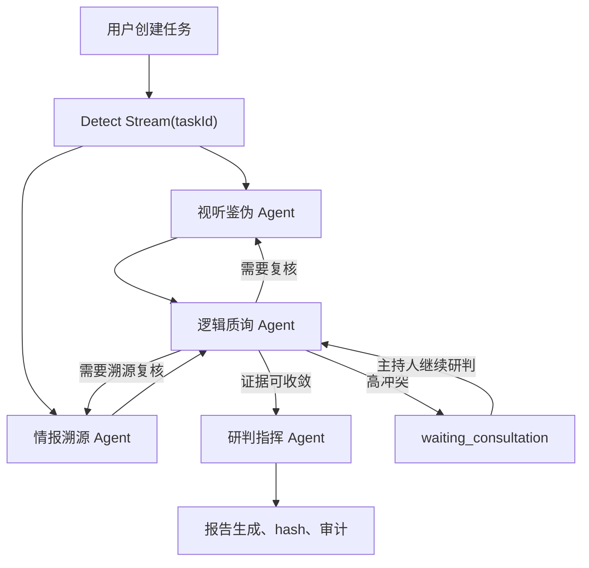

# TruthSeeker 应用流程

> 更新时间：2026-04-20

## 1. 输入边界

用户一次最多上传 5 个检材文件，单文件沿用 500MB 上限。支持类型：

- 视频：`video/mp4`、`video/webm`
- 音频：`audio/mpeg`、`audio/wav`
- 图片：`image/jpeg`、`image/png`、`image/webp`
- 文本文件：`text/plain`

上传界面的文本框不是待检测文本输入区，而是“检测提示词”：可填写简要案件描述、来源背景、分析提示、重点风险点。该提示词会写入 `case_prompt`，并传给视听鉴伪、情报溯源、逻辑质询和研判指挥四类 Agent。

文本检材中的 URL、域名、IP、可疑正文等应保存为 `.txt` 文件后在多媒体上传区上传，由情报溯源 Agent 读取和分析。

## 2. 任务创建

前端流程：

1. 用户选择 1 到 5 个文件。
2. 前端逐个调用 `POST /api/v1/upload/` 上传文件。
3. 后端返回标准文件对象：`id`、`name`、`mime_type`、`size_bytes`、`modality`、`storage_path`、可选 `file_url`。
4. 前端调用 `POST /api/v1/tasks` 创建任务。
5. 检测页只携带 `taskId`，不再通过 URL 传 signed file URL。

任务表约定：

- `description` 保存 `case_prompt`。
- `metadata.files` 保存标准化文件清单。
- `storage_paths.files` 保存文件名、模态和 storage path，不依赖前端 URL 传参启动检测。
- `input_type` 由后端根据文件模态推导，混合模态写为 `mixed`。
- 服务端只信任 JWT 中的 `request.state.user_id`，忽略客户端传入的 `user_id`。

## 3. 检测状态机

当前检测拓扑为：

关键规则：

- Forensics 与 OSINT 每轮并行执行。
- 视频、音频、图片进入视听鉴伪 Agent；文本文件只进入情报溯源 Agent。
- 逻辑质询 Agent 在前两个专家产出后审查冲突、置信度和证据充分性。
- 高冲突时触发 LangGraph in-process interrupt/checkpointer 暂停，任务状态写为 `waiting_consultation`。
- 主持人点击“继续研判”后，前端用同一个 `taskId` 发送 `resume=true`，后端用同一 `thread_id` 恢复。
- 进程内恢复只保证后端进程未重启时有效。后端重启后需要重新启动检测流程。

## 4. SSE 事件

检测流使用 `POST /api/v1/detect/stream` 返回 SSE。核心事件：

- `start`
- `node_start`
- `agent_log`
- `evidence_update`
- `forensics_result`
- `osint_result`
- `challenger_feedback`
- `consultation_required`
- `consultation_resumed`
- `task_failed`
- `final_verdict`
- `complete`

前端收到 `consultation_required` 后进入等待会诊状态；收到 `consultation_resumed` 后恢复推演；收到 `task_failed` 或 `error` 后展示失败状态。

## 5. 会诊协作

- 主持人创建邀请必须登录。
- 外部专家凭邀请令牌访问会诊页和提交意见。
- 会诊历史保存在 `consultation_messages`，面板打开时会加载历史消息。
- 专家意见写入后端后，Challenger 和 Commander 会在恢复后的研判中读取。

## 6. 报告与可信输出

检测完成后，Commander 生成最终裁决，后端写入 `reports`：

- `verdict`
- `confidence_overall`
- `summary`
- `key_evidence`
- `recommendations`
- `verdict_payload`
- `report_hash`

`report_hash` 使用 SHA-256，对规范化后的任务 ID、裁决、置信度、摘要、关键证据、建议和 verdict payload 做稳定 JSON 哈希。签名 URL、token、raw API 结果等敏感字段不进入哈希明文。

审计日志写入 `audit_logs`，覆盖 upload、task_create、detect_start、detect_failed、detect_completed、report_generated、report_downloaded、share_created、share_viewed、consultation_message、consultation_resume。

## 7. 暂不实现

- 案例库真实加载：当前仍保留演示/占位能力，等核心功能稳定后再升级真实案例库。
- 向量库 / pgvector：本次不实现，只作为后续检索增强能力保留在规划中。
