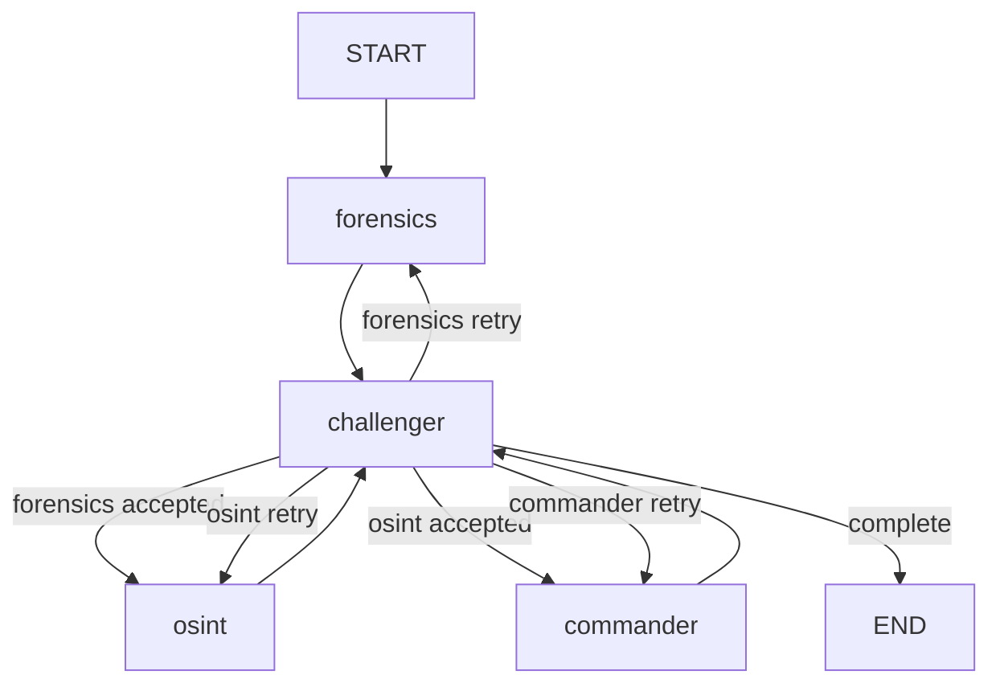

# TruthSeeker 后端结构

> 更新时间：2026-04-28

## 1. 当前运行时边界

TruthSeeker 当前运行时是 **FedPaRS-compatible 多智能体研判架构**：

- Kimi 2.6 作为四个 Agent 共享的原生多模态推理基座。
- Reality Defender、VirusTotal、Exa 等外部工具提供专业取证、威胁情报和联网搜索能力。
- LangGraph 负责阶段式 Agent 编排和收敛路由。
- Supabase 保存任务、分析快照、日志、报告、会诊和审计记录。

白皮书中的 FedPaRS 是研究底座与可替换检测器方向。除非仓库中出现真实 FedPaRS 训练/推理服务代码，否则文档不得声称当前运行时已经完成 FedPaRS 模型训练或直接推理。

## 2. 目录结构

```text
truthseeker-api/
├── app/
│   ├── config.py
│   ├── api/v1/
│   │   ├── upload.py
│   │   ├── tasks.py
│   │   ├── detect.py
│   │   ├── consultation.py
│   │   ├── report.py
│   │   ├── share.py
│   │   └── dashboard.py
│   ├── agents/
│   │   ├── graph.py
│   │   ├── state.py
│   │   ├── edges/conditions.py
│   │   ├── nodes/
│   │   │   ├── forensics.py   # 电子取证 Agent，对外仍使用 forensics key
│   │   │   ├── osint.py       # 情报溯源与图谱 Agent
│   │   │   ├── challenger.py
│   │   │   └── commander.py
│   │   └── tools/
│   │       ├── deepfake_api.py
│   │       ├── threat_intel.py
│   │       ├── text_detection.py
│   │       ├── osint_search.py
│   │       ├── provenance_graph.py
│   │       └── llm_client.py
│   ├── services/
│   │   ├── evidence_files.py
│   │   ├── text_validation.py
│   │   ├── auth_config.py       # 认证配置辅助（JWT 设置、公开路由白名单）
│   │   ├── analysis_persistence.py
│   │   ├── report_integrity.py
│   │   ├── audit_log.py
│   │   └── report_generator.py
│   └── utils/supabase_client.py
├── sql/migrations/
└── tests/
```

## 3. 核心状态

`TruthSeekerState` 必须继续使用 `TypedDict`，不能改成 Pydantic 模型。新增字段遵循兼容原则：旧字段仍保留，新流程只扩展内部状态。

重要字段：

- `analysis_phase`: `forensics | osint | commander | complete`
- `phase_rounds`: 每个阶段当前轮次，默认每阶段从 1 开始。
- `phase_quality_history`: 每阶段质量评分历史，用于 0.08 阈值收敛。
- `tool_results`: 电子取证和 OSINT 工具 all-settled 结果。
- `provenance_graph`: 阶段图谱或最终审定图谱。

兼容字段：

- `forensics_result`
- `osint_result`
- `challenger_feedback`
- `final_verdict`
- `evidence_board`
- `logs`
- `timeline_events`

## 4. LangGraph 拓扑



`challenger_route()` 是唯一的条件路由入口：

- `analysis_phase=forensics` 且需要补证：返回 `forensics`
- `analysis_phase=forensics` 且通过：返回 `osint`
- `analysis_phase=osint` 且需要补证：返回 `osint`
- `analysis_phase=osint` 且通过：返回 `commander`
- `analysis_phase=commander` 且需要修订：返回 `commander`
- `analysis_phase=commander` 且通过：返回 `end`

## 5. 工具与 LLM

Kimi 2.6：

- 默认 `KIMI_MODEL=kimi-k2.6`。
- 多模态输入通过短期 signed URL 引用传递。
- 日志、报告和持久化不保存 signed URL 明文。

Reality Defender：

- 电子取证阶段处理所有媒体文件。
- 返回成功、降级或失败结构。

VirusTotal：

- 电子取证阶段扫描所有文件哈希和文本 IOC。
- OSINT 阶段可对 Exa 搜索产生的新 IOC 追加查询。

Exa：

- 只在后端运行时调用 Exa API。
- 只发送脱敏搜索线索。
- 无 key、超时或网络失败时返回结构化降级结果。

## 6. 持久化与报告

不新增数据库表。图谱复用 JSONB：

- `analysis_states.result_snapshot.osint.provenance_graph`
- `reports.verdict_payload.provenance_graph`
- `tasks.result.provenance_graph`

`analysis_states.result_snapshot` 继续保存 `forensics/osint/challenger/final_verdict`，避免前端历史回放、会诊恢复和报告生成失效。

`reports.verdict` 仍只允许：

- `authentic`
- `suspicious`
- `forged`
- `inconclusive`

## 7. 前端兼容

后端仍发送旧 SSE 事件。检测台可新增图谱视图，但不得要求后端新增必须消费的新事件。最终图谱从 `final_verdict.provenance_graph` 读取。

## 8. 测试要求

- 状态路由和收敛逻辑必须有纯函数测试。
- 工具 all-settled 结果必须有单元测试。
- 图谱 schema 必须有单元测试。
- SSE 和持久化必须验证旧 key 兼容。
- 外部 API 测试必须 mock，不能依赖真实网络或真实密钥。
