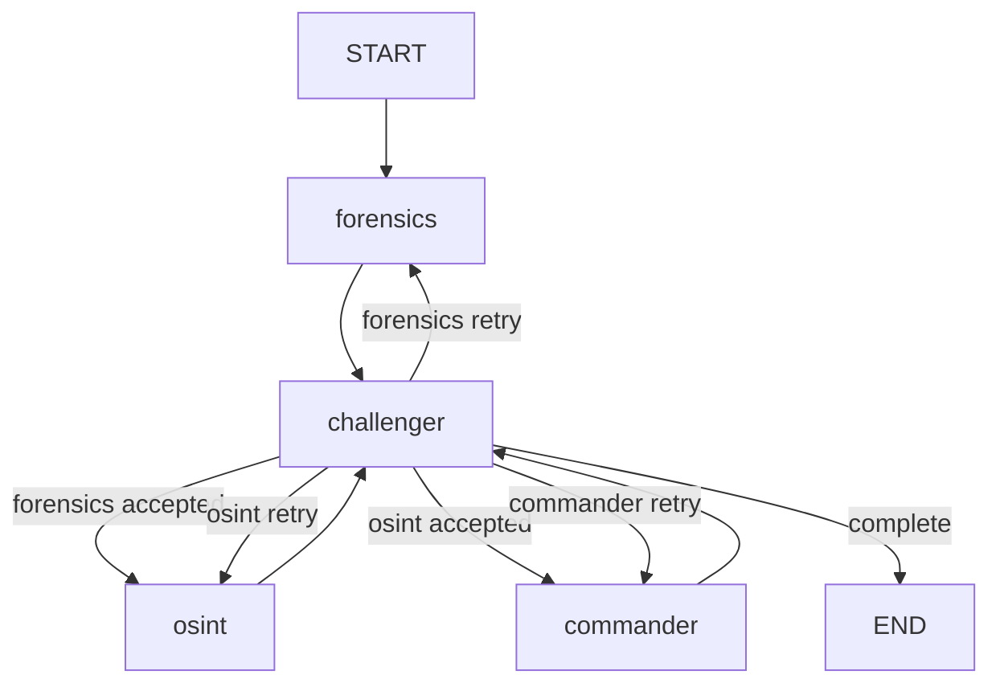

# TruthSeeker 后端结构

> 更新时间：2026-06-02

## 1. 当前运行时边界

TruthSeeker 当前运行时是 **FedPaRS-compatible 多智能体研判架构**：

- Kimi 2.5 作为四个 Agent 共享的原生多模态推理基座，并禁用 thinking。
- Sightengine、Reality Defender、VirusTotal、Exa、WhoisXML 等外部工具提供专业取证、威胁情报、联网搜索和域名溯源能力；文本 AIGC 检测改为内部工具。
- 公开案例 RAG 使用 Supabase pgvector 和 SiliconFlow `Qwen/Qwen3-VL-Embedding-8B` embedding，为 Forensics/OSINT 提供类案参考。
- LangGraph 负责阶段式 Agent 编排和收敛路由。
- Supabase 保存任务、分析快照、日志、报告、会诊和审计记录。

白皮书中的 FedPaRS 是研究底座与可替换检测器方向。除非仓库中出现真实 FedPaRS 训练/推理服务代码，否则文档不得声称当前运行时已经完成 FedPaRS 模型训练或直接推理。

## 2. 目录结构

```text
truthseeker-api/
├── app/
│   ├── config.py
│   ├── api/v1/
│   │   ├── upload.py
│   │   ├── tasks.py
│   │   ├── detect.py
│   │   ├── consultation.py
│   │   ├── report.py
│   │   ├── share.py
│   │   └── dashboard.py
│   ├── agents/
│   │   ├── graph.py
│   │   ├── state.py
│   │   ├── edges/conditions.py
│   │   ├── nodes/
│   │   │   ├── forensics.py   # 电子取证 Agent，对外仍使用 forensics key
│   │   │   ├── osint.py       # 情报溯源与图谱 Agent
│   │   │   ├── challenger.py
│   │   │   └── commander.py
│   │   └── tools/
│   │       ├── deepfake_api.py
│   │       ├── domain_provenance.py
│   │       ├── threat_intel.py
│   │       ├── internal_text_aigc.py
│   │       ├── text_detection.py
│   │       ├── osint_search.py
│   │       ├── provenance_graph.py
│   │       └── llm_client.py
│   ├── services/
│   │   ├── builtin_cases.py
│   │   ├── case_rag.py
│   │   ├── evidence_files.py
│   │   ├── text_validation.py
│   │   ├── auth_config.py       # 认证配置辅助（JWT 设置、公开路由白名单）
│   │   ├── analysis_persistence.py
│   │   ├── report_integrity.py
│   │   ├── audit_log.py
│   │   └── report_generator.py
│   └── utils/supabase_client.py
├── sql/migrations/
└── tests/
```

## 3. 核心状态

`TruthSeekerState` 必须继续使用 `TypedDict`，不能改成 Pydantic 模型。新增字段遵循兼容原则：旧字段仍保留，新流程只扩展内部状态。

重要字段：

- `analysis_phase`: `forensics | osint | commander | complete`
- `phase_rounds`: 每个阶段当前轮次，默认每阶段从 1 开始。
- `phase_quality_history`: 每阶段质量评分历史，用于 0.08 阈值收敛。
- `consultation_sessions`: 已知会诊 session 列表，包含首次自动触发、重复触发审批、跳过本次、摘要待确认和摘要确认状态。
- `consultation_trigger_history`: Challenger 对同一目标 Agent 的质询历史，用于判断 3 轮 high 质询、置信度 `< 0.8`、相邻变化 `< 0.08`。
- `active_consultation_session` / `pending_consultation_approval` / `confirmed_consultation_summary`: 当前会诊、待用户审批会诊和已确认摘要。
- `tool_results`: 电子取证和 OSINT 工具 all-settled 结果。
- `provenance_graph`: 阶段图谱或最终审定图谱。

兼容字段：

- `forensics_result`
- `osint_result`
- `challenger_feedback`
- `final_verdict`
- `evidence_board`
- `logs`
- `timeline_events`

## 4. LangGraph 拓扑



`challenger_route()` 是唯一的条件路由入口：

- `analysis_phase=forensics` 且需要补证：返回 `forensics`
- `analysis_phase=forensics` 且通过：返回 `osint`
- `analysis_phase=osint` 且需要补证：返回 `osint`
- `analysis_phase=osint` 且通过：返回 `commander`
- `analysis_phase=commander` 且需要修订：返回 `commander`
- `analysis_phase=commander` 且通过：返回 `end`

## 5. 工具与 LLM

Kimi 2.5：

- 默认 `KIMI_MODEL=kimi-k2.5`，调用时禁用 thinking。
- 多模态输入通过短期 signed URL 引用传递。
- 日志、报告和持久化不保存 signed URL 明文。

Sightengine / Reality Defender：

- 图片默认由 Sightengine `genai` 做 AIGC 图片检测。
- 音频和视频保留 Reality Defender 合成/篡改检测，作为音视频工具链。
- 返回成功、降级或失败结构。
- 运行时主字段统一为 `aigc_probability`、`is_aigc`、`aigc_score`；旧 `deepfake_probability`、`is_deepfake`、`deepfake_score` 只允许作为历史 JSONB 快照读取兼容，不再作为新报告主字段。

VirusTotal：

- 电子取证阶段扫描所有文件哈希和文本 IOC。
- OSINT 阶段可对 Exa 搜索产生的新 IOC 追加查询。
- URL 检测优先轮询 analysis `completed` 后采信统计；若新提交扫描长时间 queued，会按官方 unpadded base64 URL identifier 回查 `/api/v3/urls/{url_id}` 的既有 `last_analysis_stats`。同一任务内相同 URL 复用已完成结果，避免扫描尚未完成时把空统计误写成 0 家检出。

内部文本 AIGC 检测：

- Forensics 和 OSINT 都会对上传文本检材调用内部 `ai_text_detector`，不再依赖外部文本 AIGC API。
- `internal_text_aigc.py` 负责把 `text_detection.analyze_text()` 规范化为工具矩阵结果，`provider=internal_text_detector`。
- `text_detection.py` 融合 Kimi 文本判断、本地句长/词汇多样性/起伏度/重复短语/模板化话术统计，以及社工诱导风险特征。
- 文本检测分数只作为概率性佐证，不能单独替代样本上下文、工具证据、情报核验或人工复核。

WhoisXML：

- OSINT 阶段对 URL/域名线索查询 WHOIS 注册信息和 DNS 历史记录。
- 未配置 key、超时或网络失败时返回结构化降级结果，不把“缺数据”写成“无异常”。

Exa：

- 只在后端运行时调用 Exa API。
- 只发送脱敏搜索线索。
- 无 key、超时或网络失败时返回结构化降级结果。

公开案例 RAG：

- `case_library_rag_chunks` 保存真实公开案例与内置案例 Markdown 分块、`vector(1024)` embedding、分类/裁决元数据和全文检索字段。
- embedding 使用独立配置：`EMBEDDING_BASE_URL`、`EMBEDDING_API_KEY`、`EMBEDDING_MODEL`、`EMBEDDING_DIMENSIONS`，默认模型为 SiliconFlow `Qwen/Qwen3-VL-Embedding-8B`。
- Forensics 和 OSINT 运行时调用 `case_rag_search`，混合 vector 召回与关键词召回。结果只作为类案参考，不直接改变当前裁决分数。
- `scripts/rebuild_case_rag_index.py --include-builtin --include-public` 用于回填内置案例和历史公开案例。
- `scripts/delete_public_case_rag_chunks.py --title-contains "案例标题" --apply` 用于清理已删除公开案例遗留的向量 chunks；默认 dry-run。

## 6. 持久化与报告

图谱复用 JSONB：

- `analysis_states.result_snapshot.osint.provenance_graph`
- `reports.verdict_payload.provenance_graph`
- `tasks.result.provenance_graph`

`analysis_states.result_snapshot` 继续保存 `forensics/osint/challenger/final_verdict`，避免前端历史回放、会诊恢复和报告生成失效。

会诊持久化：

- `consultation_sessions`: 每轮会诊一行，记录状态、触发原因、目标 Agent、阶段/轮次、repeat index、上下文、关闭时间和摘要。
- `consultation_invites`: 按任务和 session 生成专家链接，当前运行时默认 `INVITE_TTL_HOURS = 24`。邀请过期后不能提交意见；同一链接可标记为 `used`，允许专家刷新同一上下文。
- `consultation_messages`: 保存 Commander、用户和专家消息；结构化列包括 `session_id`、`message_type`、`anchor_agent`、`anchor_phase`、`confidence`、`suggested_action` 和 `metadata`。
- `audit_logs`: 记录会诊触发、审批、跳过、结束、摘要确认、恢复研判和邀请创建。

会诊恢复：

- 首次满足“同一目标最近 3 轮 high 质询、本轮置信度 `< 0.8`、相邻置信度变化均 `< 0.08`”时，后端发送 `consultation_required` 并写入 active session。
- 同一任务再次满足门槛时，后端发送 `consultation_approval_required` 并写入 `waiting_user_approval` session；用户可批准或跳过本次。
- 用户结束会诊后，Commander 生成 `summary_pending` 摘要；用户确认/编辑摘要后，session 进入 `summary_confirmed`。
- `resume=true` 时读取 `consultation_messages`、`consultation_sessions` 和已确认摘要回注状态；checkpoint 丢失时，从 `analysis_states` 重建 Commander 可裁决状态。
- 报告必须保留会诊触发原因、用户确认后的摘要和关键意见摘录，而不是完整复刻聊天或静默合并人工意见。

`reports.verdict` 仍只允许：

- `authentic`
- `suspicious`
- `forged`
- `inconclusive`

## 7. 前端兼容

后端仍发送旧 SSE 事件。检测台可新增图谱视图，但不得要求后端新增必须消费的新事件。最终图谱从 `final_verdict.provenance_graph` 读取。

## 8. 测试要求

- 状态路由和收敛逻辑必须有纯函数测试。
- 工具 all-settled 结果必须有单元测试。
- 图谱 schema 必须有单元测试。
- SSE 和持久化必须验证旧 key 兼容。
- 会诊触发、首次自动暂停、重复触发审批、邀请 TTL、摘要确认、恢复和结束动作必须有 API 或服务层测试。
- 外部 API 测试必须 mock，不能依赖真实网络或真实密钥。
