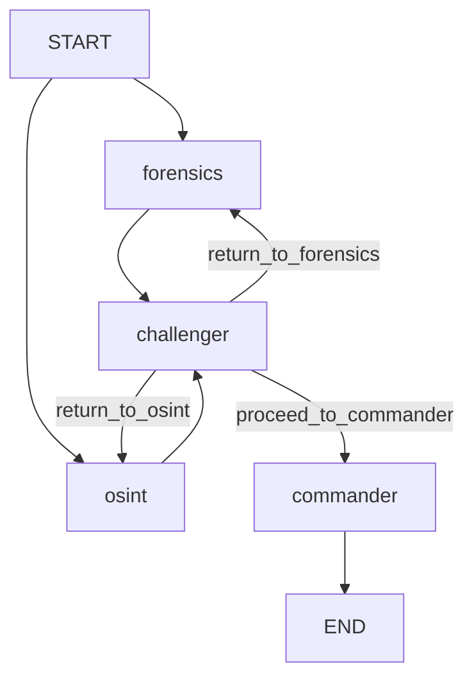

# TruthSeeker 后端结构

> 更新时间：2026-04-21

## 1. 目录结构

```text
truthseeker-api/
├── app/
│   ├── main.py
│   ├── config.py
│   ├── api/v1/
│   │   ├── upload.py          # 文件上传到 Supabase Storage
│   │   ├── tasks.py           # 任务创建、查询
│   │   ├── detect.py          # SSE 检测流、暂停/恢复
│   │   ├── consultation.py    # 会诊邀请、消息、历史
│   │   ├── report.py          # Markdown/PDF 下载
│   │   ├── share.py           # 报告分享
│   │   └── dashboard.py
│   ├── agents/
│   │   ├── graph.py           # LangGraph 拓扑与内存 checkpointer
│   │   ├── state.py           # TruthSeekerState
│   │   ├── nodes/
│   │   │   ├── forensics.py   # 视听鉴伪 Agent
│   │   │   ├── osint.py       # 情报溯源 Agent
│   │   │   ├── challenger.py  # 逻辑质询 Agent
│   │   │   └── commander.py   # 研判指挥 Agent
│   │   └── tools/
│   │       ├── deepfake_api.py
│   │       ├── threat_intel.py
│   │       ├── text_detection.py
│   │       └── llm_client.py
│   ├── middleware/
│   │   ├── auth.py
│   │   ├── exception_handler.py
│   │   └── rate_limit.py
│   ├── services/
│   │   ├── auth_config.py
│   │   ├── evidence_files.py
│   │   ├── text_validation.py   # 文本上传校验（扩展名白名单、控制字符比例检测、多编码尝试、二进制伪装检测）
│   │   ├── analysis_persistence.py
│   │   ├── report_integrity.py
│   │   ├── audit_log.py
│   │   └── report_generator.py
│   └── utils/supabase_client.py
├── sql/migrations/
└── tests/
```

## 2. 当前运行时边界

白皮书中的底层训练底座表述是目标架构：基于 FedPaRS 联邦学习训练底座产出检测 API，供上层 Agent 调用。

当前代码运行时尚不包含联邦学习训练代码，实际执行路径是：

- Reality Defender 等外部检测 API
- VirusTotal / 元数据 / 文本 URL 提取等情报能力
- Kimi/Moonshot LLM 推理
- LangGraph 多智能体编排

因此，代码层面只需要保证“调用现成检测 API + 多智能体研判闭环”可靠；FedPaRS 训练底座后续替换底层 API 来源即可。

## 3. 核心数据契约

### UploadedEvidenceFile

```typescript
interface UploadedEvidenceFile {
  id: string
  name: string
  mime_type: string
  size_bytes: number
  modality: "video" | "audio" | "image" | "text"
  storage_path: string
  file_url?: string
}
```

规则：

- 一次最多 5 个文件。
- 单文件最大 500MB。
- `file_url` 可选，检测启动时后端可根据 `storage_path` 重新生成最新 signed URL。
- 文本框内容不是待检测文本，保存为 `case_prompt`。

### POST /api/v1/tasks

请求重点字段：

- `description`: 保存 `case_prompt`
- `metadata.files`: 保存标准化文件清单
- `storage_paths.files`: 保存 storage path 和模态
- `priority_focus`: `visual | audio | text | balanced`

后端行为：

- 校验至少存在 1 个文件。
- 根据文件模态推导 `input_type`，混合模态为 `mixed`。
- 忽略客户端传入的 `user_id`，只使用 JWT 中的 `request.state.user_id`。
- 写入 `audit_logs.action = task_create`。

### POST /api/v1/detect/stream

支持字段：

```json
{
  "task_id": "uuid",
  "resume": false,
  "case_prompt": "可选覆盖",
  "files": [],
  "input_type": "video|audio|image|text|mixed"
}
```

正常启动时，后端优先从任务记录读取文件清单；如果文件缺少 `file_url`，根据 `storage_path` 生成 24 小时 signed URL。

恢复研判时，前端使用同一 `task_id` 并传 `resume=true`，后端优先用 LangGraph `Command(resume=...)` 和同一 `thread_id` 恢复。若内存 checkpoint 因进程重启丢失，后端会基于 `analysis_states` 的最近 Agent 快照和 `consultation_messages` 重建 Commander 可裁决状态。

## 4. LangGraph 拓扑



说明：

- `forensics` 只处理视频、音频、图片。
- `osint` 处理文本文件，并可结合媒体文件做哈希、元数据和威胁情报检查。
- `challenger` 发现高冲突时通过 LangGraph interrupt 暂停。
- `commander` 基于证据板、质询记录、专家意见和全局提示词生成最终裁决。

## 5. 数据库迁移

已有核心迁移：

- `20260415_baseline_schema_rls.sql`
- `20260416_full_fix.sql`
- `20260420_consultation_messages.sql`
- `20260420_report_hash_audit_logs.sql`

关键表：

- `tasks`
- `analysis_states`
- `agent_logs`
- `reports`
- `consultation_invites`
- `consultation_messages`
- `audit_logs`

`reports.report_hash` 为 SHA-256 稳定哈希，用于报告防篡改展示。

`20260415_baseline_schema_rls.sql` 包含从零建库所需的核心表、索引和 RLS policy。后续增量迁移继续保持幂等，评审或新环境可按文件名顺序执行。

`audit_logs` 记录关键闭环动作：

- upload
- task_create
- detect_start
- detect_failed
- detect_completed
- report_generated
- report_downloaded
- share_created
- share_viewed
- consultation_message
- consultation_resume

## 6. 权限边界

受保护接口：

- 上传
- 创建任务
- 启动检测
- 报告下载
- 创建分享
- 主持人创建邀请与恢复研判

公开但受令牌校验的接口：

- 分享页 `GET /api/v1/share/{token}`
- 专家邀请校验 `GET /api/v1/consultation/invite/{token}`
- 会诊消息读取 `GET /api/v1/consultation/{task_id}/messages?invite_token=...`
- 专家提交意见 `POST /api/v1/consultation/{task_id}/inject`，必须提供有效邀请令牌

`APP_ENV=production` 时必须配置真实 `SUPABASE_JWT_SECRET`，否则后端拒绝启动。本地开发可使用 `NOT_SET` 关闭认证中间件，但不能按生产安全口径部署。

## 7. 暂不实现

- pgvector / 向量库：本次不实现，后续用于相似案例检索和威胁特征召回。
- 案例库真实加载：当前保留演示能力，等检测闭环稳定后再接真实案例。
