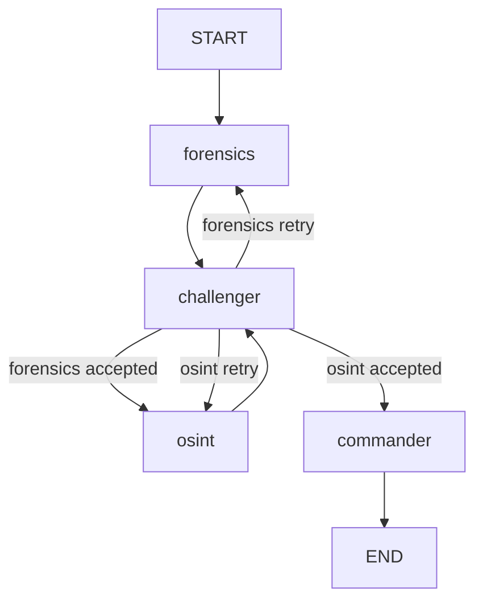

# TruthSeeker 后端结构

> 更新时间：2026-08-16

## 1. 当前运行时边界

TruthSeeker 当前运行时是 **Fed-MBPR-compatible 多智能体研判架构**：

- 四个 Agent 共享可配置的原生多模态推理基座；默认 Kimi 2.6，调用 Kimi K2.6 时禁用 thinking，也可切换小米 MiMo Token Plan。
- Sightengine、Reality Defender、VirusTotal、Exa、WhoisXML 等外部工具提供专业取证、威胁情报、联网搜索和域名溯源能力；文本 AIGC 检测改为内部工具。
- 公开案例 RAG 使用 Supabase pgvector 和 SiliconFlow `Qwen/Qwen3-VL-Embedding-8B` embedding，为 Forensics/OSINT 提供类案参考。
- 个人经验库使用同一 embedding 技术栈，为当前账号的 Forensics/OSINT/Challenger 提供私有方法参考。
- LangGraph 负责阶段式 Agent 编排和收敛路由。
- Supabase 保存任务、分析快照、日志、报告、人机协同和审计记录。

白皮书中的 Fed-MBPR 是研究底座与可替换检测器方向。除非仓库中出现真实 Fed-MBPR 训练/推理服务代码，否则文档不得声称当前运行时已经完成 Fed-MBPR 模型训练或直接推理。

## 2. 目录结构

```text
truthseeker-api/
├── app/
│   ├── config.py
│   ├── api/v1/
│   │   ├── router.py          # 所有路由集中注册入口
│   │   ├── upload.py
│   │   ├── tasks.py
│   │   ├── detect.py
│   │   ├── cases.py
│   │   ├── consultation.py    # collaboration canonical + consultation 兼容别名
│   │   ├── experiences.py
│   │   ├── report.py
│   │   ├── share.py
│   │   └── dashboard.py
│   ├── agents/
│   │   ├── graph.py
│   │   ├── state.py
│   │   ├── edges/conditions.py
│   │   ├── nodes/
│   │   │   ├── forensics.py   # 电子取证 Agent，对外仍使用 forensics key
│   │   │   ├── osint.py       # 情报溯源与图谱 Agent
│   │   │   ├── challenger.py
│   │   │   └── commander.py
│   │   ├── skills/            # Agent 核心 Skill 包（loader.py + 4 个固定绑定 SKILL.md 包）
│   │   └── tools/
│   │       ├── deepfake_api.py
│   │       ├── audio_transcription.py  # ASR 音频语义转写（Groq Whisper / 百度短语音识别极速版，provider 可切换）
│   │       ├── video_observation.py    # 视频观察：原生视频内联 / ffmpeg 关键帧
│   │       ├── domain_provenance.py
│   │       ├── threat_intel.py
│   │       ├── internal_text_aigc.py
│   │       ├── text_detection.py
│   │       ├── osint_search.py
│   │       ├── provenance_graph.py
│   │       ├── fallback.py    # DegradationManager 与 shared_degradation
│   │       └── llm_client.py
│   ├── services/
│   │   ├── builtin_cases.py
│   │   ├── case_library.py
│   │   ├── case_rag.py
│   │   ├── consultation_workflow.py
│   │   ├── experience_library.py
│   │   ├── evidence_access.py
│   │   ├── evidence_files.py
│   │   ├── input_types.py
│   │   ├── text_validation.py
│   │   ├── auth_config.py       # 认证配置辅助（JWT 设置、公开路由白名单）
│   │   ├── analysis_persistence.py
│   │   ├── report_integrity.py
│   │   ├── audit_log.py
│   │   └── report_generator.py
│   └── utils/supabase_client.py
├── scripts/                   # 运维脚本（案例 RAG 重建/清理，见 §5）
├── sql/migrations/
└── tests/
```

## 3. 核心状态

`TruthSeekerState` 必须继续使用 `TypedDict`，不能改成 Pydantic 模型。新增字段遵循兼容原则：旧字段仍保留，新流程只扩展内部状态。

重要字段：

- `analysis_phase`: `forensics | osint | commander | complete`
- `phase_rounds`: 每个阶段当前轮次，默认每阶段从 1 开始。
- `phase_quality_history`: 每阶段质量评分历史，用于记录变化趋势和协同停滞判断；不直接决定 Challenger 阶段放行。
- `collaboration_sessions`: 已知人机协同 session 列表，包含首次自动触发、重复触发审批、跳过本次、摘要待确认和摘要确认状态。
- `collaboration_trigger_history`: Challenger 对同一目标 Agent 的质询历史，用于判断 3 轮低置信、置信度 `< 0.8`、相邻变化 `< 0.08`；每阶段协同次数上限由 `CONSULTATION_MAX_SESSIONS_PER_PHASE` 控制（默认 1）。
- `active_collaboration_session` / `pending_collaboration_approval` / `confirmed_collaboration_summary`: 当前协同、待用户审批协同和已确认摘要。
- `consultation_*`: 历史兼容字段，读取旧任务时兜底；新流程主写 `collaboration_*`。
- `tool_results`: 电子取证和 OSINT 工具 all-settled 结果。
- `provenance_graph`: 阶段图谱或最终审定图谱。

兼容字段：

- `forensics_result`
- `osint_result`
- `challenger_feedback`
- `final_verdict`
- `evidence_board`
- `logs`
- `timeline_events`

## 4. LangGraph 拓扑


```mermaid
flowchart TD
  START --> F["forensics"]
  F --> C["challenger"]
  C -->|forensics retry| F
  C -->|forensics accepted| O["osint"]
  O --> C
  C -->|osint retry| O
  C -->|osint accepted| M["commander"]
  M --> END
```

`challenger_route()` 是唯一的条件路由入口：

- `analysis_phase=forensics` 且需要补证：返回 `forensics`
- `analysis_phase=forensics` 且通过：返回 `osint`
- `analysis_phase=osint` 且需要补证：返回 `osint`
- `analysis_phase=osint` 且通过：返回 `commander`

Commander 生成最终裁决后直接 `END`，不再回到 Challenger。旧的 Commander 后质询会造成完成后再次中断、报告按钮隐藏或重复会诊，当前代码已移除该边。

## 5. 工具与 LLM

Agent LLM：

- 默认 `KIMI_MODEL=kimi-k2.6`，调用时禁用 thinking。
- `AGENT_LLM_PROVIDER=kimi-k2.6|mimo` 控制四个 Agent 的底层全模态模型入口；选择 K2.6 时，`KIMI_PROVIDER=official|coding|siliconflow` 选择具体渠道；选择 `mimo` 时，使用 `MIMO_BASE_URL=https://token-plan-cn.xiaomimimo.com/v1`、`MIMO_API_KEY`、`MIMO_MODEL=mimo-v2.5`。
- `AGENT_LLM_MAX_OUTPUT_TOKENS=4096` 控制 TruthSeeker 单次 Agent LLM 输出上限。
- Kimi K2.6：输入 `text,image,video`，上下文 262144 tokens，本系统固定 `thinking=disabled`。
- MiMo `mimo-v2.5`：输入 `text,image`，官方上下文 1048576 tokens，官方输出上限 131072 tokens；`MIMO_THINKING=enabled|disabled` 可显式控制思考模式，本系统默认 enabled。MiMo 不作为视频/音频原生理解底座，视频/音频仍依赖工具结果、文本摘要或抽帧图片。
- Agent LLM provider 只影响 Forensics/OSINT/Challenger/Commander 的模型推理和摘要生成，不替换 Sightengine、Reality Defender、VirusTotal、Exa、WhoisXML 或 embedding API。
- 多模态输入通过短期 signed URL 引用或 base64 图片内联传递；视频检材仅在取证阶段以 `video_url`（原生视频 base64）或关键帧图片进入模型上下文（见“视频检材观察”）。
- 日志、报告和持久化不保存 signed URL 明文。

Sightengine / Reality Defender：

- 图片默认由 Sightengine `genai` 做 AIGC 图片检测。
- 音频由 Reality Defender 做合成/篡改检测。
- 视频按 RD 免费套餐能力边界分解，不再整段上传（会被 403 `free-tier-restriction` 拒绝）：
  - 画面 → `video_keyframe_aigc`：ffmpeg 均匀抽 3 帧关键帧，逐帧送 Sightengine `genai`，聚合帧间最大 AI 生成概率（任一帧 ≥0.5 判 `is_aigc`），参与 `media_aigc_probability` 评分；聚合结果只保留逐帧概率，不携带原始响应。视频画面维度由该工具覆盖，结果携带 `analysis_scope=video_visual_keyframes` 与范围说明，下游不得据此宣称“视频画面检测缺失”。
  - 音轨 → `reality_defender`（工具名不变）：ffmpeg 抽取音轨为 mp3 后按音频送 RD；视频无音轨是正常结论（`success + analysis_available=false`），不计降级。结果携带 `detection_scope=video_audio_track`、`analysis_scope=audio_track_only` 与范围说明，其 `aigc_probability` 仅代表音频合成/篡改维度，不是视频画面伪造概率。
  - 检测范围标注随工具摘要（`检测范围=仅视频音轨…`、`视频画面检测（关键帧抽样）…`）进入工具矩阵、报告、上游已核验结论引用块与各 LLM 上下文；跨轮复用成功结果时会按当前代码重新生成摘要，保证标注口径一致。
- 返回成功、降级或失败结构。
- 运行时主字段统一为 `aigc_probability`、`is_aigc`、`aigc_score`；旧 `deepfake_probability`、`is_deepfake`、`deepfake_score` 只允许作为历史 JSONB 快照读取兼容，不再作为新报告主字段。

音频 ASR 语义转写（audio_transcription）：

- ASR 服务商由 `AUDIO_ASR_PROVIDER=groq|baidu` 切换（.env 热加载，配好对应 Key 即可）：`groq`（默认）走 Groq OpenAI 兼容 `/audio/transcriptions`（`whisper-large-v3-turbo`）；`baidu` 走百度智能云短语音识别极速版 `POST https://vop.baidu.com/pro_api`（`dev_pid=80001` 普通话输入法模型），token 由 `BAIDU_ASR_TOKEN_URL` 按 client_credentials 获取并进程级缓存（提前 1 小时刷新），token 推迟到真正要识别时才取——无音轨视频等无需上传的场景不发起任何百度请求。转写结果进入工具矩阵和 `forensics_result.audio_transcripts`，供取证 LLM 校验音频语义与文本主题一致性。
- 百度极速版单次识别限 60 秒且仅接受 pcm/wav/amr/m4a（16kHz 单声道），不支持 mp3/flac 等格式：ffmpeg 可用时统一本地归一化为 16kHz 单声道 wav 并按 55 秒分段（`-f segment`，音频/视频共用，视频经 `-vn` 直接取音轨），逐段 JSON+base64 上传后拼接全文，长音频最多转写前 20 段（`BAIDU_MAX_SEGMENTS`，约 18 分钟）并在结果 note 注明；ffmpeg 不可用时仅 wav/amr/m4a/pcm 原样直传（超 60 秒由服务端 err_no 拒绝后降级）。空语音类 err_no（2000/3301/3314）按空转写成功处理（等价 Groq 对静音返回空文本），服务端繁忙/限流类 err_no（3303/3304/3307/3313/3315）按传输层同款策略重试，其余业务 err_no 映射为可自解释降级原因（如 3302→鉴权失败、3308→音频超 60 秒）。
- 视频检材先用 ffprobe 探测音轨：无音轨记录正常结论并跳过上传；Groq 路径有音轨时用 ffmpeg 抽取 16kHz 单声道 mp3 上传。ffmpeg/ffprobe 按 `FFMPEG_BINARY`/`FFPROBE_BINARY` → PATH → `C:\Users\user\ffmpeg\bin` 顺序解析；配置值必须指向真实存在的文件，无效配置（dotenv 不支持行内注释，`FFMPEG_BINARY=  # 说明` 会把注释读成路径）自动回退 PATH 查找。
- 所有 ffmpeg/ffprobe 调用统一走 `audio_transcription._run_process`（视频观察共用）：线程池 + 同步 `subprocess.run`，不依赖事件循环类型。不要用 `asyncio.create_subprocess_exec`——Windows 下 uvicorn 以 `--reload` 或多 worker 启动时会把事件循环固定为 SelectorEventLoop（`uvicorn.loops.asyncio.asyncio_loop_factory`），该循环不实现子进程 transport，会抛空消息 `NotImplementedError`。超时由 subprocess 自行终止子进程并转成 `asyncio.TimeoutError`。
- `AUDIO_ASR_ENABLED=false` 时完全不分发；未配置对应服务商 Key（Groq 需 `GROQ_API_KEY`；百度需 `BAIDU_ASR_API_KEY` + `BAIDU_ASR_SECRET_KEY` 两者齐全）、ffmpeg 缺失、文件超限或服务商失败时按结构化降级写入工具矩阵，不虚构转写内容。Groq 401/403 分别映射为 key 无效与 key 被拒/工作区模型权限限制的明确降级原因；百度 token 端点 400/401/403 映射为凭证错误。
- 转写摘要随 `audio_transcript_summaries` 注入 OSINT 的“上游已核验结论引用”块；该字段属于证据内容而非鉴伪结论。

视频检材观察（video_observation）：

- 该路径负责取证 LLM 对画面的自主观察；工具级视频 AIGC 检测由“Sightengine / Reality Defender”一节的分解路径承担，两者互补。
- kimi-k2.6 在 Moonshot 官方平台原生支持视频理解，但仅 `KIMI_PROVIDER=official` 确认支持 `video_url`（SiliconFlow 视频输入未确认，coding 端点无视觉能力），因此视频观察只在取证阶段的多模态调用中启用（`observe_video`），其他 Agent 保持文本引用，不重复消耗视觉 token。
- 观察优先级：official 渠道且视频 ≤ 40MB → base64 data URI 走 `video_url` 整段传入；其他渠道、视频过大或内联准备失败 → ffmpeg 按时长均匀抽取最多 6 帧关键帧（宽度压到 1280 以内）按图片传入；两条路都不可用 → 保留文本边界说明，模型如实写明可见输入边界。
- 视频下载上限 300MB（与 ASR 一致）；signed URL 与 Supabase storage path 均可作为下载来源。

VirusTotal：

- 电子取证阶段扫描所有文件哈希和文本 IOC。
- OSINT 阶段可对 Exa 搜索产生的新 IOC 追加查询。
- URL 检测优先轮询 analysis `completed` 后采信统计；若新提交扫描长时间 queued，会按官方 unpadded base64 URL identifier 回查 `/api/v3/urls/{url_id}` 的既有 `last_analysis_stats`。同一任务内相同 URL 复用已完成结果，避免扫描尚未完成时把空统计误写成 0 家检出。

内部文本 AIGC 检测：

- Forensics 和 OSINT 都会对上传文本检材调用内部 `ai_text_detector`，不再依赖外部文本 AIGC API。
- `internal_text_aigc.py` 负责把 `text_detection.analyze_text()` 规范化为工具矩阵结果，`provider=internal_text_detector`。
- `text_detection.py` 当前由内部工具以 `use_llm=False` 调用，使用本地句长、词汇多样性、起伏度、重复短语、模板化话术统计和社工诱导风险特征。
- 文本检测分数只作为概率性佐证，不能单独替代样本上下文、工具证据、情报核验或人工复核。

WhoisXML：

- OSINT 阶段对 URL/域名线索查询 WHOIS 注册信息、DNS Lookup 当前 A/AAAA/CNAME 记录和 IP Geolocation 归属信息。
- DNS Lookup 优先查询完整主机名；完整主机名没有 A/AAAA 时查询 CNAME 并解析 CNAME 目标；仍没有 IP 时再回退到注册域。
- 未配置 key、超时或网络失败时返回结构化降级结果，不把“缺数据”写成“无异常”。
- WHOIS 主查询成功但 DNS Lookup 或 IP Geolocation 返回 403 时记录为 `partial`：报告保留注册时间/注册商等已取得信息，并提示子产品权限或额度受限，而不是写成整个 WhoisXML 工具失败。
- 默认链路不调用 DNS History/历史 IP 产品。Commander 会依据本轮组件状态校正建议：WHOIS 已成功或部分成功取得注册信息时不得再次列为待执行动作；若确需历史 IP，只能明确写成需要另行启用并授权 DNS History 的扩展复核。

Exa：

- 只在后端运行时调用 Exa API。
- 只发送脱敏且具备案件特异性的搜索线索；存在 URL/域名 IOC 时优先使用精确主机查询，不把 WhoisXML/VirusTotal 工具摘要或泛化风险标签当作搜索词。
- 域名查询结果必须在标题、URL 或摘要中命中该主机/注册域，未命中的厂商产品页和泛化页面不进入证据链，也不增加风险分。
- `ConnectError` 对同一幂等搜索最多执行 3 次总尝试（0.5s、1.5s 退避）；仍失败时对本批次熔断并合并为一个结构化 `connection_failed`，避免按查询重复展示同一连接故障。OSINT 外层超时覆盖全部 3 条查询及其重试预算。
- 搜索调用成功但没有案件 IOC 直接命中时返回 `success + no_case_specific_matches`，表示“已检索、暂无直接公开佐证”，不计为工具降级；无关语义候选仍会被拒绝并记录检查数量。
- 无 key、超时或网络失败时才返回结构化降级/失败结果。

公开案例 RAG：

- `case_library_rag_chunks` 保存真实公开案例与内置案例 Markdown 分块、`vector(1024)` embedding、分类/裁决元数据和全文检索字段。
- embedding 使用独立配置：`EMBEDDING_BASE_URL`、`EMBEDDING_API_KEY`、`EMBEDDING_MODEL`、`EMBEDDING_DIMENSIONS`，默认模型为 SiliconFlow `Qwen/Qwen3-VL-Embedding-8B`。
- Forensics 和 OSINT 运行时调用 `case_rag_search`，混合 vector 召回与关键词召回。结果只作为类案参考，不直接改变当前裁决分数。
- `scripts/rebuild_case_rag_index.py --include-builtin --include-public` 用于回填内置案例和历史公开案例。
- `scripts/delete_public_case_rag_chunks.py --title-contains "案例标题" --apply` 用于清理已删除公开案例遗留的向量 chunks；默认 dry-run。

个人经验库 RAG：

- `experience_library_entries` 保存当前账号确认入库的经验条目，字段包括来源 task/session、目标 agents、标题、适用问题、推荐方法、证据检查项、升级条件、限制和内容 hash。
- `experience_library_rag_chunks` 保存按 `target_agent` 拆分的向量块，RLS 按 `user_id = auth.uid()` 隔离。
- `build_experience_drafts()` 在人机协同结束后调用 Commander LLM 抽取 0/1/N 条草稿，并在展示给用户前按 `user_id + target_agents` 过滤已有相似经验。
- `confirm_experience_drafts()` 在用户确认入库时再次规范化和去重，写入经验表并为每个目标 Agent 创建向量块。
- `experience_rag_search()` 按 `user_id + target_agent` 检索，仅返回当前账号、当前 Agent 的个人经验。
- `delete_experience()` 先删除经验向量块，再删除经验条目。

## 6. 持久化与报告

图谱复用 JSONB：

- `analysis_states.result_snapshot.osint.provenance_graph`
- `reports.verdict_payload.provenance_graph`
- `tasks.result.provenance_graph`

`analysis_states.result_snapshot` 继续保存 `forensics/osint/challenger/final_verdict`，避免前端历史回放、协同恢复和报告生成失效。

人机协同持久化：

- `collaboration_sessions`: 每轮协同一行，记录状态、触发原因、目标 Agent、阶段/轮次、repeat index、上下文、关闭时间和摘要。
- `collaboration_invites`: 按任务和 session 生成专家链接，当前运行时默认 `INVITE_TTL_HOURS = 24`。邀请过期后不能提交意见；同一链接可标记为 `used`，允许专家刷新同一上下文。
- `collaboration_messages`: 保存 Commander、用户和专家消息；结构化列包括 `session_id`、`message_type`、`anchor_agent`、`anchor_phase`、`confidence`、`suggested_action` 和 `metadata`。
- `consultation_sessions` / `consultation_invites` / `consultation_messages`: 旧表保留只读兼容；迁移 `20260605_collaboration_tables.sql` 会复制历史数据到新表，不在本次删除旧表。
- `audit_logs`: 记录协同触发、审批、跳过、结束、摘要确认、恢复研判和邀请创建。
- `/collaboration/{task_id}/agent-history` 只把任务本体作为强依赖；`agent_logs`、`analysis_states`、`reports`、`audit_logs` 任一历史源临时失败时返回其余可用数据，并在 `history_warnings` 标出降级来源，避免刷新检测台整体 500。

协同恢复：

- 前 4 轮 Challenger 置信度 `< 0.8` 必须打回目标 Agent；第 5 轮达到阶段最大轮次时直接放行，并把低置信或未解决问题写入残留风险。
- 首次满足“同一目标最近 3 轮置信度均 `< 0.8`、相邻置信度变化均 `< 0.08`”时，后端发送 `collaboration_required` 并写入 active session。每阶段每次检测最多协同 1 次（`CONSULTATION_MAX_SESSIONS_PER_PHASE` 默认 1），超过上限直接带残留风险放行；单次协同最多提出 3 个问题（`CONSULTATION_MAX_QUESTIONS` 默认 3），且属于其他阶段职责的越界质询点在触发前已被确定性过滤。
- 同一目标 Agent 再次满足门槛时，后端发送 `collaboration_approval_required` 并写入 `waiting_user_approval` session；用户可批准或跳过本次。当前每阶段 1 次的协同上限下该路径通常不会命中，保留为配置兜底。
- 用户结束协同后，Commander 调用大模型阅读 `context_payload.help_needed`、专家任务和协同消息，生成 `summary_pending` 摘要；摘要生成与个人经验草稿提炼并发运行，总耗时取两次调用中的较慢者。协同路由不再额外设置 12 秒短超时，稍慢但有效的模型结果仍会被采纳；底层 LLM 客户端继续负责网络超时、瞬时错误重试和真实失败降级。LLM 不可用或输出契约无效时，本地兜底按编号意见提炼结论、确认态与回注建议，不得直接拼接或按字符截断聊天原文。用户确认/编辑摘要后，session 进入 `summary_confirmed`。
- 用户结束协同后，Commander 同步抽取个人经验草稿；`evidence_to_check` 等可编辑非关键清单的字符串/常见对象漂移会先安全归一化为数组，必填标题、适用 Agent、问题模式和方法仍保持严格合同。草稿生成或合同检查失败时返回空草稿及可见降级原因。摘要确认不会自动入库；前端直接消费 close/confirm 接口返回的 session 展示草稿，不依赖发送端收到自己的 Realtime 广播；历史空快照也显示缺失原因。确认摘要接口会保留 `summary_payload.experience_drafts`，避免草稿在摘要确认时丢失。
- `resume=true` 时读取 `collaboration_messages`、`collaboration_sessions` 和已确认摘要回注状态；checkpoint 丢失时，从 `analysis_states` 重建 Commander 可裁决状态。旧 `consultation_*` 数据作为历史兜底读取。
- 报告必须保留协同触发原因、用户确认后的摘要和关键意见摘录，而不是完整复刻聊天或静默合并人工意见。

`reports.verdict` 仍只允许：

- `authentic`
- `suspicious`
- `forged`
- `inconclusive`

## 7. 前端兼容

后端仍发送旧 SSE 事件。检测台可新增图谱视图，但不得要求后端新增必须消费的新事件。最终图谱从 `final_verdict.provenance_graph` 读取。

## 8. 测试要求

- 状态路由和收敛逻辑必须有纯函数测试。
- 工具 all-settled 结果必须有单元测试。
- 图谱 schema 必须有单元测试。
- SSE 和持久化必须验证旧 key 兼容。
- 人机协同触发、首次自动暂停、重复触发审批、邀请 TTL、摘要确认、恢复和结束动作必须有 API 或服务层测试。
- 外部 API 测试必须 mock，不能依赖真实网络或真实密钥。
